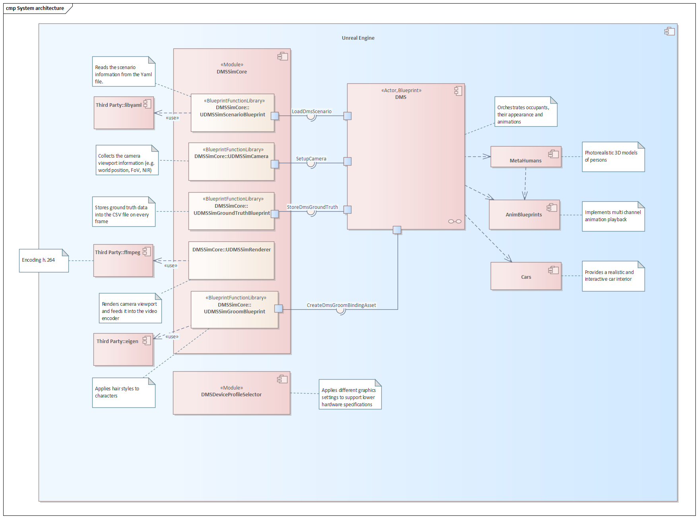

# 00. System architecture and principal components

## System architecture

The virtual DMS/OMS simulation is based on Unreal Engine and uses the engine functionality heavily. 

Significant portions are implemented using Blueprint scripting.

The main logic is realized within the DMS actor (Blueprint) and is supported by the DMSSimCore plugin module (C++).

## Principal components

###  DMS actor

Implemented as a Blueprint actor, it is the centerpiece of the solution and is responsible for managing 3D models. 
It triggers scenario loading, creates car, characters and applies appearance to them.

It is also responsible for triggering ground truth data extraction.

The DMS actor cannot be found at [Content/Actors/DMS](../../../DMS_Simulation/Content/Actors/DMS.uasset)

### DMSSimCore

The C++ plugin `DMSSimCore` implements functionality such as parsing YAML scenarios, building animation montages, recording ground truth data and saving videos.

The plugin `DMSSimCore` can be found at [Plugins/DMSSimCore](../../../DMS_Simulation/Plugins/DMSSimCore).

### MetaHumans

MetaHumans are realistic 3D models of persons. They are implemented as blueprint actors. 

MetaHumans are located under [Content/MetaHumans](../../../DMS_Simulation/Content/MetaHumans).

### Animation Blueprints

Face and body animation of MetaHumans are controlled by Animation Blueprints based on animation montages provided by the DMSSimCore plugin.

Animation blueprints are also responsible to apply the multi-channel blending system.

Animation blueprints are located at [Content/Animations/Anim_Blueprints/Body_AnimBlueprint](../../../DMS_Simulation/Content/Animations/Anim_Blueprints/Body_AnimBlueprint.uasset) and [Content/MetaHumans/Common/Face/Face_AnimBP](../../../DMS_Simulation/Content/MetaHumans/Common/Face/Face_AnimBP.uasset).

### Cars

Currently we only have one car model, Audi A5. It is implemented as a blueprint actor. 

It provides interface for front seat adjustment and steering wheel rotation.

The Audi A5 model is located under [Content/Models/Cars/Audi_A5/Car/Blueprints/BP_AudiA5](../../../DMS_Simulation/Content/Models/Cars/Audi_A5/Car/Blueprints/BP_AudiA5.uasset)

###  DMSDeviceProfileSelect

This C++ plugin loads and applies device profiles based on command-line input.

Device profiles are used to reduce the hardware requirements.

The plugin can be found under [Plugins/DMSDeviceProfileSelector](../../../DMS_Simulation/Plugins/DMSDeviceProfileSelector).
