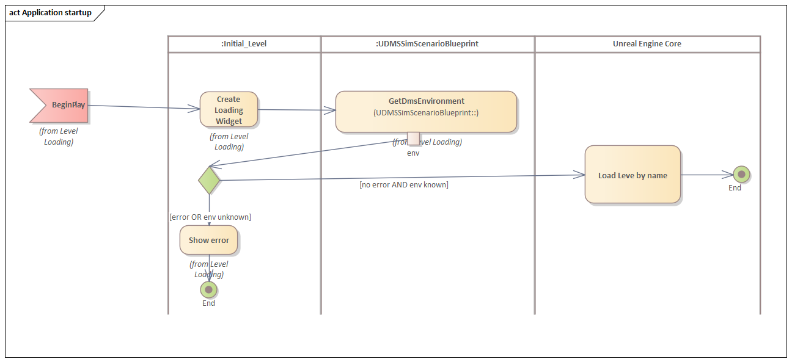
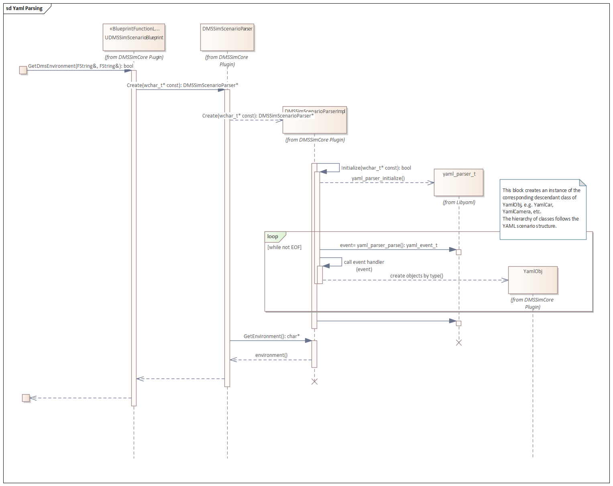

# 01. Application startup and YAML scenario parsing

## Table of contents
1. [Initial level](#Initial_level)
2. [YAML scenario parsing](#YAML_parsing)
3. [YAML config file parsing](#YAML_config_parsing)
## Initial level 

In Unreal Engine, the whenever you start the executable, it will load the startup level.

The particular level in our project is [Content/Maps/Initial_Level.umap](../../../DMS_Simulation/Content/Maps/Initial_Level.umap).

Each level has its level blueprint which gets called after all actors on this level.

The job of the initial level is to initiate parsing of the YAML scenario, extract the environment name and redirect to the corresponding level.

See [Available levels](../02-Scene_creation_DMS_car_camera/README.md#Available_levels) for the list of available environments.

## YAML scenario parsing 

Scenarios are described as YAML files. The parsing is implemented in [DMSSimScenarioBlueprint](../../../DMS_Simulation/Plugins/DMSSimCore/Source/DMSSimCore/Public/DMSSimScenarioBlueprint.h).

It offers multiple functions, such as
+ `GetDmsEnvironment` - parses the YAML scenario and returns the environment name specified therein;
+ `LoadDmsScenarioMulti` - parses the YAML scenario and returns static information: e.g. about car and occupant appearance; 
+ `GetDmsAnimationsMulti` - parses the YAML scenario and returns containers of animation montages for each occupant.

As you can see, each of the functions parses the YAML file, and the parsing routine is the same as below.

We use the `libyaml` library to read YAML files. The library tokenizes the file and emits events such as `sequence start/end`, `mapping start/end` or `scalar`.

We subscribe to those events and depending on their types, create or update the hierarchy of objects to follow the YAML file structure. Here we can also validate the YAML file for correctness.

The basic wiring of the `libyaml` can be found in [DMSSimParserBase](../../../DMS_Simulation/Plugins/DMSSimCore/Source/DMSSimCore/Private/DMSSimParserBase.cpp).

The implementation of the scenario object hierarchy and its mapping to `libyaml` events can be found in [DMSSimScenarioParser](../../../DMS_Simulation/Plugins/DMSSimCore/Source/DMSSimCore/Private/DMSSimScenarioParser.cpp).

## YAML config file parsing 

The project config file is also specified in YAML format.

Its parsing is implemented in [DMSSimConfigParser](../../../DMS_Simulation/Plugins/DMSSimCore/Source/DMSSimCore/Private/DMSSimConfigParser.cpp) and is, in essence, the same as with scenario YAML.
