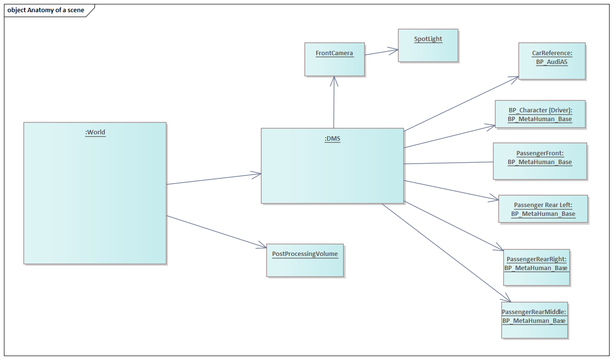
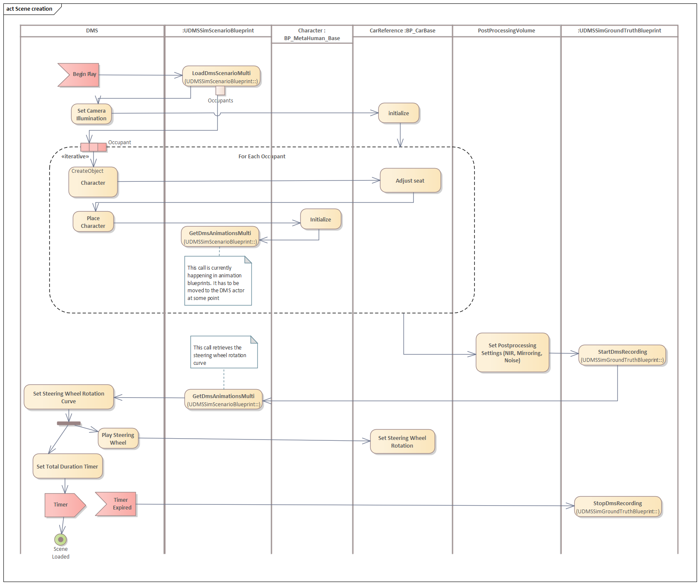
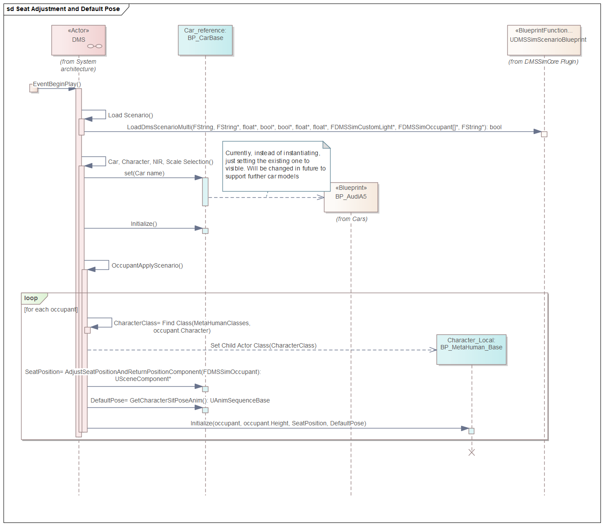

# 02. Scene creation, DMS actor, car, camera

## Table of contents
1. [Available levels (environments)](#Available_levels)
2. [Anatomy of an environment](#Anatomy)
3. [Scene creation by DMS actor](#DMS)
4. [NIR simulation and mirroring](#NIR)
5. [Level blueprint](#Level_blueprint)
    1. [Camera parameters](#Camera_parameters)
    2. [Car movement](#Car_movement)

## Available levels (environments) 

Following environments implemented in the system

+ [Urban](../../../DMS_Simulation/Content/ModularBuildingSet/Urban_Map.umap)
+ [Forest](../../../DMS_Simulation/Content/RuralAustralia/Maps/Forest_map.umap)
+ [Procedural](../../../DMS_Simulation/Content/Maps/Procedural_Map.umap)
+ [Procedural_Forest](../../../DMS_Simulation/Content/Maps/Procedural_Forest_Map.umap)
+ [Procedural_Urban](../../../DMS_Simulation/Content/Maps/Procedural_Urban_Map.umap)

The main difference between plain and procedural environments lies in the motion of the car.

In plain environments, objects outside of the car are static and the car moves across it. Once the car has reached the end of the road it gets teleported to its start. 

In procedural environment, the car is stationary, whereas the environment is moving around it. Buildings, trees, etc. are created dynamically and moving towards the car. 

The primary reason for creating procedural environments is hair physics, which seems to have issues when the car is moving.
## Anatomy of an environment 

Every environment in the DMS/OMS simulation toolchain (except for the initial level), contains one instance of the [DMS actor](../../../DMS_Simulation/Content/Actors/DMS.uasset).

The `DMS actor` contains child component for the camera, child actor components for the car and each of the occupants.

The [child actor components](https://docs.unrealengine.com/4.27/en-US/BlueprintAPI/ChildActorComponent/) enable creation of child actors in both design- and runtime.

Another important object present in every level is [PostProcessVolume](https://docs.unrealengine.com/4.27/en-US/RenderingAndGraphics/PostProcessEffects/) which enables NIR simulation (desaturation) and mirroring in both design- and runtime.

## Scene creation by DMS actor 

Once the level is loaded and the `DMS actor` is created, it receives the `BeginPlay` event and loads the scenario.

`DMS actor` first loads the static part of the scenario from the `DMSSimScenarioBlueprint`.

It creates the car and adjusts camera illumination.

Then `DMS actor` proceeds to instantiate characters. The `DMS actor` contains a list of classes corresponding to each character name. It instantiates characters and places them on corresponding seats.

Each character also receives the default pose based on their seat position in the car.

Finally, initalization of each character is triggered, in order to apply [their appearance](../03-Character_appearance/README.md).

## NIR simulation and mirroring 

In order to enable NIR simulation, `DMS actor` interacts with the `PostProcessVolume` in the scene and changes its settings, in particular `PostProcessMaterials`.

Depending on NIR/Mirroring settings in the scenario, a corresponding [Post Procesing Material (shader)](../../../DMS_Simulation/Content/Materials/Post_Process) will be applied to the rendered image. The shaders operate on the 2D texture where the scene is rendered onto.

NIR is simulated by means of image desaturation. 
Mirroring is handling by flipping the X coordinate of the pixel.

## Level blueprint 

Every level in Unreal Engine has its own level blueprint which orchestrates objects available in that level.

We use level blueprints for special purposes as outlined below.

### Camera parameters 

The camera parameters, such as pose, FOV, framerate are not handled by the `DMS actor`. Doing so in the `DMS actor` would result in limited design-time functionality.

Instead, camera parameters are set by the [DMSSimCameraBlueprint](../../../DMS_Simulation/Plugins/DMSSimCore/Source/DMSSimCore/Public/DMSSimCameraBlueprint.h), which is wired in the _Level blueprints_ of each level. 
This way the `DMSSimCameraBlueprint` has full control of camera parameters and can ensure that the same camera is also used for video capture.

Camera illumination is handled by the `DMS actor.

### Car movement 

The logic of moving car in static environments, or spawning/moving of surrounding objects in procedural ones is implemented in corresponding level blueprints.