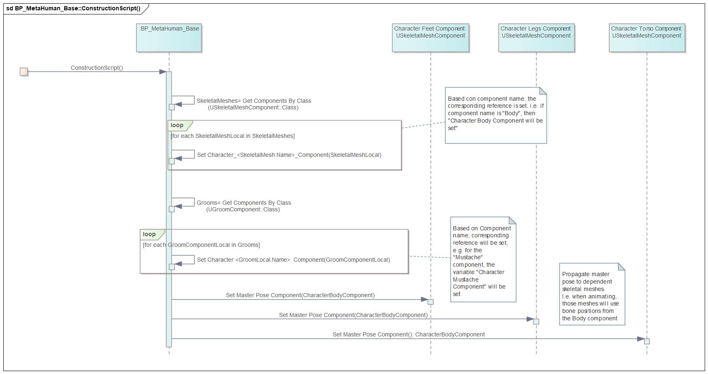
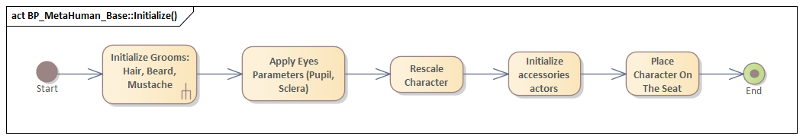
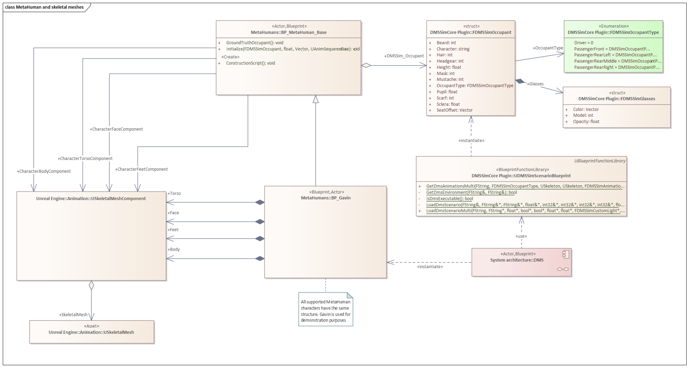
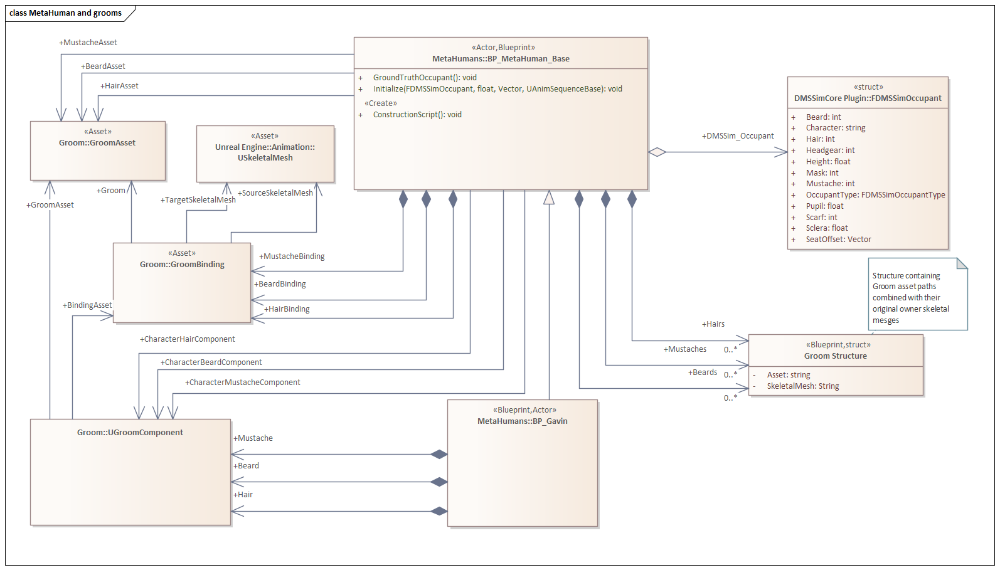
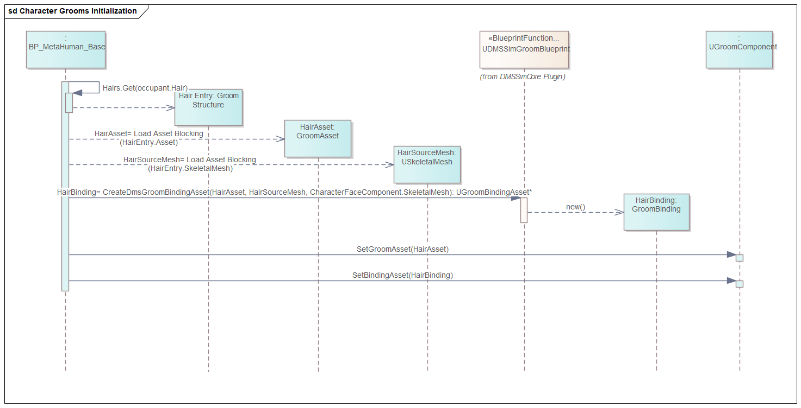
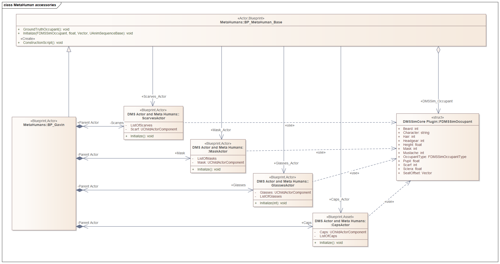
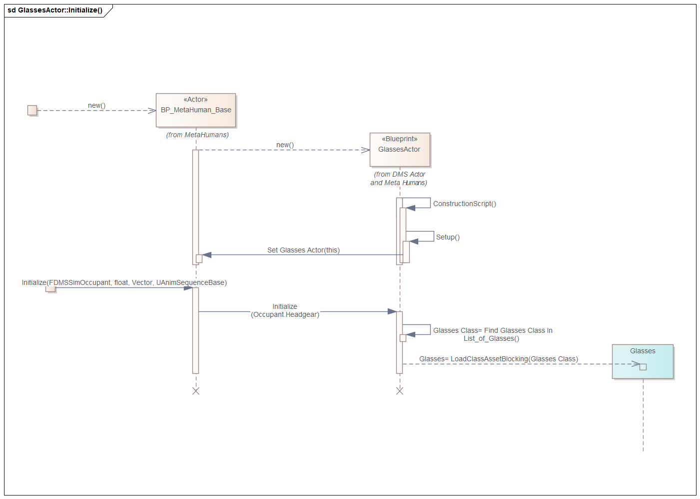

# 03. Character appearance

## Table of contents
1. [MetaHuman class initialization](#metahuman-class-initialization)
2. [Skeletal meshes](#skeletal-meshes)
3. [Groom assets: hair, beard, mustache](#groom-assets-hair-beard-mustache)
4. [Accessories: glasses, hats, masks, scarves](#accessories-glasses-hats-masks-scarves)
5. [Character height](#character-height)
6. [Pupil and sclera effects](#pupil-and-sclera-effects)
7. [Seating the character](#seating-the-character)
8. [Asset lookup](#asset-lookup)

## MetaHuman class initialization 

The class `BP_MetaHuman_Base` implements both `ConstructionScript` and function `Initialize`.

The `ConstructionScript` acts as a default constructor. It accepts no parameters and performs basic wiring of the concrete descendant of `BP_MetaHuman_Base` class to the uniform interface of ´BP_MetaHuman_Base`.

Besides, it performs wiring of the master pose component, i.e. ensures that the all `skeletal mesh components` except for `Face` use animations from the `Body` component.

In order to provide parameters from the scenario, function `Initialize` is implemented. It takes the `DMSSimOccupant` structure as an input, applies character appearance and places the character on the seat.

## Skeletal meshes 

The virtual persons are provided by MetaHuman. They are implemented as blueprint actors and have the same structure containing a set of `Skeletal mesh` and `Groom` components. 

All MetaHuman classes are located under [Content/MetaHumans](../../../DMS_Simulation/Content/MetaHumans) in folders corresponding to their names. Each class is named `BP_<Charname>`. For example, [BP_Gavin](../../../DMS_Simulation/Content/MetaHumans/Gavin/BP_Gavin.uasset).

We introduced the blueprint class  [BP_MetaHuman_Base](../../../DMS_Simulation/Content/MetaHumans/BP_Metahuman_Base.uasset) as a parent for all MetaHuman classes. Initially they had no parent base class despite having identical structure.

The struct `FDMSSimOccupant` is provided by the `DMSSimScenarioBlueprint` and serves as a description of the character.

The class `BP_MetaHuman_Base` provides a uniform interface for all MetaHumans and serves as a bridge between scenario YAML parser and MetaHuman 3D models. It applies the `FDMSSimOccupant` struct to concrete MetaHuman implementations.

The diagram below shows the relation betwen classes `BP_Gavin`, `BP_MetaHuman_Base`, `FDMSSimOccupant` and `UStaticMeshComponent`.

The concrete MetaHuman class, e.g. `BP_Gavin` owns a series of skeletal mesh components: `Face`, `Body`, `Torso`, `Feet`, `Legs`, etc linked to corresponding `Skeletal mesh assets`. Those assets are specific for each character.

The base class `BP_MetaHuman_Base` contains references to each of those mesh components, in order to provide a uniform interface to the structure of the MetaHuman class.

## Groom assets: hair, beard, mustache 

Character hair, mustaches and beards are implemented using [groom assets](https://docs.unrealengine.com/4.27/en-US/WorkingWithContent/Hair/GroomAssetEditor/). A `groom asset` combines skeletal and particle simulation. In order to attach a `groom asset` to a character, one needs a `groom component`. 

A `groom asset` is tailored to a particular face `skeletal mesh`. In order to apply a `groom asset` from one character to another, one needs a `groom binding asset`, which maps the `groom asset` to both source and target `skeletal meshes`.

Similar to `skeletal meshes`, each MetaHuman character owns its inherent `groom assets` and `groom bindings`. The `BP_MetaHuman_Base` class provides uniform references to both `grooms` and `bindings`.

In order to generate `groom bindings`, one needs to know which character the particular `groom` belonged to at first place, or, to be more precise, for which particular face `skeletal mesh` it was sculpted. This information for supported hair styles, beards and mustaches is stored in the `Groom Structure` within `BP_MetaHuman_Base` and is used when character appearance is applied.

The process is illustrated for the `Hair groom component`. It is identical for beards and mustaches.

Groom binding generation can be done using standard Unreal Engine tools, however only in the editor. As groom binding size is quite large, instead of generating all valid combinations up front, we reimplemented groom binding generation at runtime within [DMSSimGroomBlueprint](../../../DMS_Simulation/Plugins/DMSSimCore/Source/DMSSimCore/Public/DMSSimGroomBlueprint.h).

## Accessories: glasses, hats, masks, scarves 

Selection of accessories is implemented as a set of child actors.

+ [Headgears](../../../DMS_Simulation/Content/Models/Headgears/Caps_Actor.uasset)
+ [Masks](../../../DMS_Simulation/Content/Models/Masks/Mask_Actor.uasset)
+ [Scarves](../../../DMS_Simulation/Content/Models/Scarves/Scarves_Actor.uasset)
+ [Glasses](../../../DMS_Simulation/Content/Models/Glasses/Glasses_Actor.uasset)

Those child actors are attached to each MetaHuman character in appropriate positions. As with `skeletal meshes`and `grooms`, the class `BP_MetaHuman_Base` maintains uniform references to the child actors.

All accessories child actors are handled in the same way. Upon creation of MetaHuman classes, construction script is called automatically without arguments. It is used by accessories actors to propagate their self-references to the `BP_MetaHuman_Base` class. At that point they do not load any assets and just sit as placeholders. The position of attachment is however set. 

Subsequently, when the `Initialize` function of `BP_MetaHuman_Base` class is called, the _index_ of the corresponding `accessory asset`is passed to the corresponding `accessory actor`, which then identifies the class name of that asset and loads it.

The diagram below illustrates the process for the `Glasses` actor. Other `accessory actors` are implemented the same way.

## Character height 

Different character height is achieved by scaling them. Each MetaHuman character has the inherent height. If the desired height is positive, a ratio between the desired and inherent height is calculated and the complete corresponding character is scaled proportionally, including head, hands, etc.

## Pupil and sclera effects 

The bright / dark pupil effects and sclera darkening for NIR simulation is not implemented based on physics (light angle, retina reflection, etc.) but rather implemented as additional parameters in the eye rendering shader.

The parameters are passed from the `BP_MetaHuman_Base` class to all materials on the `Face` skeletal mesh, and implemented by the shaders of eyes.

Every character's eye has its own materials inheriting ultimately from [Content/MetaHumans/Common/Face/LookDev/Shared/EyeMaterials/M_EyeRefractive](../../../DMS_Simulation/Content/MetaHumans/Common/Face/LookDev/Shared/EyeMaterials/M_EyeRefractive.uasset).

## Seating the character 

The seat position for the character (3D coordinates) is provided by the car. In order to place the character, the middle point on character thigh is calculated, and that point is attached to the seat.

## Asset lookup 

The `DMSSimScenarioBlueprint` returns a `DMSSimOccupant` struct, most of names for accessories and hair styles are converted to `int`.

The conversion of string names to int is implemented in [DMSSimOrchestrator](../../../DMS_Simulation/Plugins/DMSSimCore/Source/DMSSimCore/Private/DMSSimOrchestrator.cpp). It utilizes the following naming convention for assets.

The actual name of an asset on disk is suffixed with the desired number.
I.e. the `BaseballCap1` is actually stored as [BaseballCap1_1_Headgears](../../../DMS_Simulation/Content/Models/Headgears/1/BaseballCap1_1_Headgears.uasset).

The `DMSSimOrchestrator` searches for an asset whose name starts with the name given in the scenario and once found, extracts the number past the underscore.

The `BP_MetaHuman_Base` maintains collections of `Groom Structure`s mapping `int` values back to actual `groom assets` such as hairs, beards, mustaches. 

The accessories actors maintain similar mappings for glasses, masks, hats and scarves.

