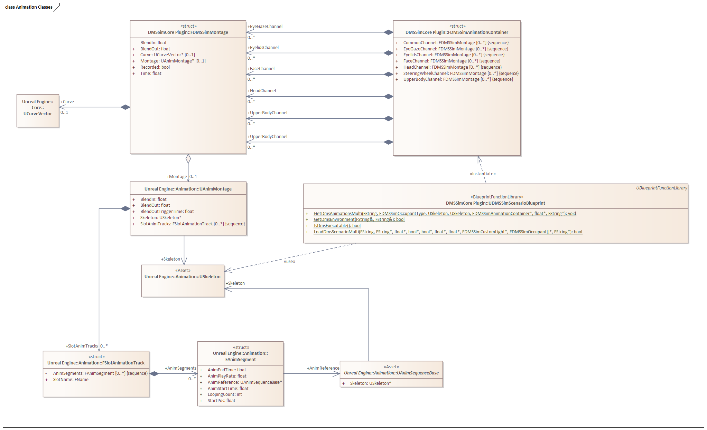
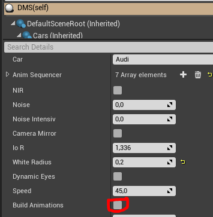

# 04. Scenario loading, animation preprocessing

## Table of contents

1. [Loading animation montages](#loading-animation-montages)
    1. [Recorded animations](#recorded-animations)
    2. [Procedural animations](#procedural-animations)
    3. [Common channel](#common-channel)
2. [Animation preprocessing](#animation-preprocessing)

## Loading animation montages 

In order to play back scenario, it needs to be loaded. The function `UDMSSimScenarioBlueprint::GetDmsAnimationsMulti` parses the YAML scenario and converts it into `FDMSSimAnimationContainer` structure for each occupant.

The hierarchy of classes can be seen below.

The structure `FDMSSimAnimationContainer` contains arrays of `FDMSSimMontage` for each channel specified in the scenario. The `AnimBlueprint` only needs to iterate over them to trigger playback in sequence.

`UDMSSimScenarioBlueprint` delegates most of the logic to [DMSSimMontageBuilder](../../../DMS_Simulation/Plugins/DMSSimCore/Source/DMSSimCore/Private/DMSSimMontageBuilder.cpp).

Defaults apply.

| Value     | Default                                                        |
|-----------|--------                                                        |
| start_pos | 0                                                              |
| end_pos   | length of the `AnimSequence` or parameter curve                |
| duration  | end_pos - start_pos                                            |
| blend_out | Value of element `channels_blendout_defaults` for this channel |

The kind of `FDMSSimMontage` is determined by the `Recorded` flag.

### Recorded animations 

In case of a recorded animation, `FDMSSimMontage` will contain an `AnimMontage`, with just one slot, whose name is dependent on the scenario channel.

| Channel    | Slot          |
|------------|---------------|
| eye_gaze   | EyeGazeSlot   |
| eyelids    | EyelidsSlot   |
| face       | FaceSlot      |
| head       | HeadSlot      |
| upper_body | UpperBodySlot |

That slot will contain a single segment, which, in turn would contain a single `AnimSequence` loaded for this channel. The `AnimSequence` is not he original one, as specified in [Animation Catalog](../../../AnimationCatalog/Generated/AnimationCatalog.md) but rather a preprocessed (filtered) one, containing only data relevant to this channel.  See [Animation preprocessing](#animation-preprocessing) section for details.

The reference to the `AnimSequence` in the montage will have the start and end positions, as well as the duration (play time) as specified in the scenario YAML file.

The `AnimMontage` will have the `BlendIn` set to the `blend_out` value of the previous animation on this channel in the scenario, and `BlendOut` corresponding to the `blend_out` for this animation in the scenario.

### Procedural animations 

If the animation is procedural, the `FDMSSimMontage` will contain a `CurveVector`, which is a sequence of `Vector`. Besides, it will also contain the `BlendIn` and `BlendOut` time for this curve, which is necessary to blend from a recorded to a procedural animation, or vice versa.

Neither the type of parameter, nor its name is transferred, because currently only one some channels allow procedural animations, and at most one type. I.e. the type of animation is implicitly known from the channel. 

When loading consecutive procedural animations on one channel, they will be concatenated into one curve.

### Common channel 

The `common` channel in the scenario does not exist in run-time. Instead the `UDMSSimScenarioBlueprint` determines its effect on other channels while loading and populates them correspondingly.

For example, if at time `T` there is no animation on `head` channel, or has an `active pause`, the corresponding animation fragment from `common` channel will be used on channel `head`.

### Handling of passive pause

The passive pause is handled as taking the last frame of the previous animation and stretching it to the duration of the pause.

## Animation preprocessing 

MetaHuman characters consist of multiple skeletal meshes, and thus, when they are recorded, multiple animation sequences are produced, i.e. `<X>` for body, `<X>_0` for face, `<X>_0_1` for torso, and so on. For reasons of scenario uniformity, we want to use a single name to identify a _group_ of animation sequences. 

Besides, layered animation blending is more complex than it seems, making it impossible to isolate channels within one `AnimSequence` while playing back animations.

With the considerations above, animation filtering preprocessor was implemented in [DMSSimAnimationBuilderBlueprint](../../../DMS_Simulation/Plugins/DMSSimCore/Source/DMSSimCore/Public/DMSSimAnimationBuilderBlueprint.h).

It runs through animation folders [Content/Animations](../../../DMS_Simulation/Content/Animations) and enumerates animation sequences found inside. 

If it detects animation `<X>` and `<X>_0`, it treats them as a one named `<X>` and derives following animation sequnces from them in the [Content/Animations/Generated](../../../DMS_Simulation/Content/Animations/Generated) folder: 

+ `<X>_EyeGaze`
+ `<X>_Eyelids`
+ `<X>_Face`
+ `<X>_Head`
+ `<X>_UpperBody` 

The `UDMSSimScenarioBlueprint::GetDmsAnimationsMulti` picks corresponding derived animations from the `Content/Animations/Generated` folder.

The generation process can be triggered either from `DMS actor`'s "Build animations" checkbox.

Or during the build from Python script [BuildAnimations.py](../../../DMS_Simulation/Content/Python/BuildAnimations.py).

For animations recorded without body (using the LiveLink Face app), the `<X>_UpperBody` file is not created.
