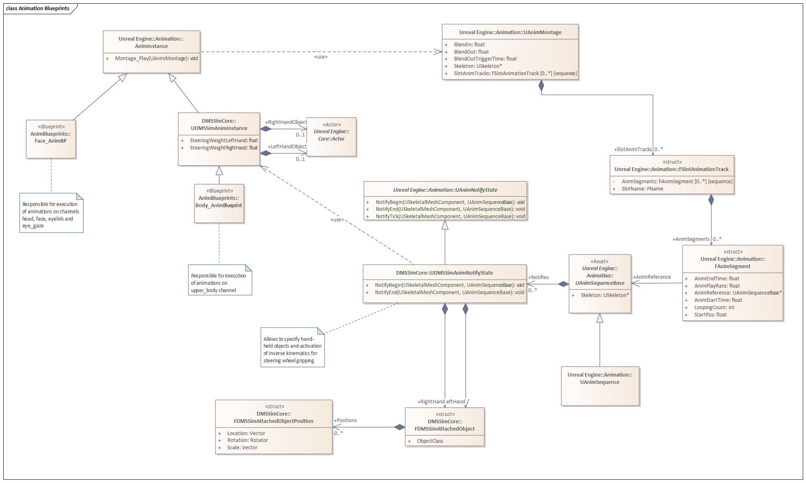
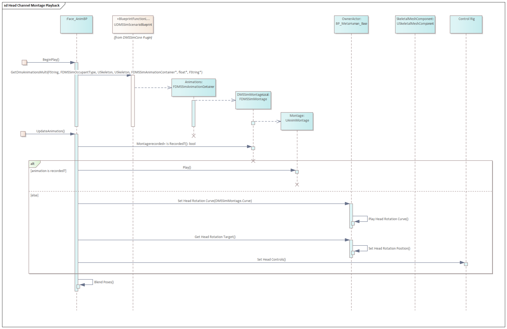
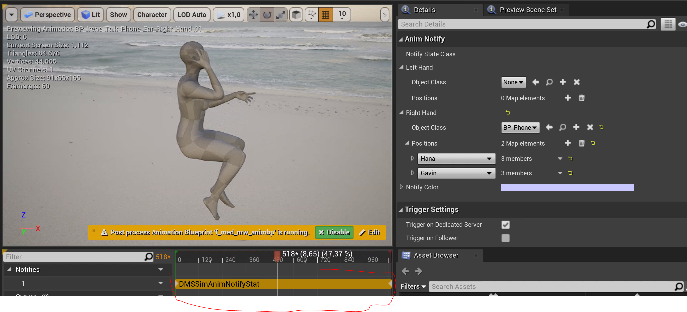
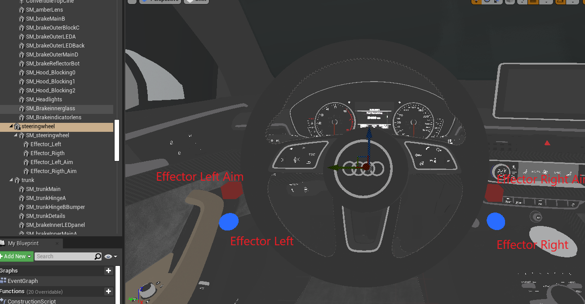

# 05. Scenario execution, recorded and procedural animations, blending, objects, steering

## Table of contents
1. [Scenario blueprint classes](#scenario-blueprint-classes)
2. [Montage playback, animation graph](#montage-playback-animation-graph)
3. [Animation Blending](#animation-blending)
4. [Hand-held objects](#hand-held-objects)
5. [Steering wheel attachment](#steering-wheel-attachment)

## Scenario blueprint classes 

The playback logic is realized in `AnimBlueprints`. 

The `Face Skeletal Mesh Component` of each MetaHuman character is animated using the [Face_AnimBP](../../../DMS_Simulation/Content/MetaHumans/Common/Face/Face_AnimBP.uasset).

The `Body Skeletal Mesh Component` of each MetaHuman character is animated using the [Body_AnimBlueprint](../../../DMS_Simulation/Content/Animations/Anim_Blueprints/Body_AnimBlueprint.uasset).

The remaining `Skeletal Mesh Components` (i.e. `Torso`, `Legs`, `Feet`) share the same `Skeleton` with `Body` and are configured to follow it as their `Master Pose Component`. 

The animation channels `eyelids`, `eye_gaze`, `face` and `head` are implemented by the `Face_AnimBP`. 

The `upper_body` channel is implemented by the `Body_AnimBlueprint`.

The `steering_wheel` channel is implemented by the `DMS actor` itself, although driver hand attachment is handled by the `Body_AnimBlueprint`.

## Montage playback, animation graph 

Montage playback is handled in animation blueprints. They combine both `Event Graph` and `Anim Graph`. 

The former handles interactions with actors, components and other blueprints. As its name suggests, it's event based and handles the temporal aspects.

The latter defines how target pose comes to life by combining different anim nodes. Nodes can be activated and deactivated by means of blend weights.

The diagram below displays schematically the control flow in case of head channel. The actual implementation is split between `Event Graph` and `Anim Graph` Other channels are implemented similarly.

The principal logic for each `DMSSimMontage` is to handle recorded and procedural animations differently. 
Recorded animations simply get played back and the pose from the corresponding slot is blended onto the character.

Procedural animations are implemented partly by the `BP_MetaHuman_Base` because only actors can play back timelines. Once the curve is playing back, `AnimBlueprint` would sample its current value and feed it to the control rig. The control rig would then produce the desired pose for this procedural animation, which is then blended onto the character.

## Animation Blending 

Sequential blending for recorded animations is embedded into montages and is handled by UE itself.

Sequential blending between procedural curves is handled by the curve builder in `DMSSimScenarioBlueprint`. That is, it concatenates multiple procedural curves into one by applying interpolation according to the blending duration.

Sequential blending betwen procedural and recorded animations is handled in the corresponding `AnimBlueprint` for this channel.

## Hand-held objects 

Objects are embedded in `AnimSequences` by means of `DMSSimAnimNotifyState`. The state specifies how long a character can have an object in each hand and the class of this object.

This is only relevant for `Upper Body` animations, because we do not support object attachment to face.

When animation is played and `NotifyBegin` of the `DMSSimAnimNotifyState` is entered, it checks if an object class is declared for each hand and instantiates an object of that class.

Conversely, when `NotifyEnd` event is called, the object created earlier is destroyed.

For animations with free hand, it is recommended to put an invisible object in free hand, e.g. [BP_EmptyHand](../../../DMS_Simulation/Content/Models/Handheld_Objects/BP_EmptyHand.uasset)

## Steering wheel attachment 

The blueprint [BP_CarBase](../../../DMS_Simulation/Content/Models/Cars/BP_CarBase.uasset) a `scene component`, whose `Roll` angle drives the rotation of the actual static mesh(es). This way, `DMS actor` can apply steering wheel rotation irrespective of the car model. 

The concrete implementation in [BP_AudiA5](../../../DMS_Simulation/Content/Models/Cars/Audi_A5/CarConfigurator/Car/Blueprints/BP_AudiA5.uasset) maps these to actual `scene components` and `static meshes`.

Whenever there is no object in driver's hand, it gets attached to the steering wheel.  Hand attachment is driven by *inverse kinematics* (*IK*). We need to define four `effectors`: one `position effector` and one `aim effector` for each hand. These effectors are statically attached to the steering wheel rim and thus rotate together with it.

The `effectors` are defined in `BP_CarBase` and mapped in `BP_AudiA5` to concrete components.

The `Body_AnimBlueprint` evaluates positions of corresponding `effectors` on every tick and applies a [Control Rig](../../../DMS_Simulation/Content/MetaHumans/Taro/Male/Medium/NormalWeight/Body/m_med_nrw_body_CtrlRig.uasset) to calculate actual arms positions based on those `effectors`.

If the hand is empty, the calculated pose for the character gets applied to the corresponding arm. Otherwise *IK* has no effect.

IK is configured to move bones `hand_l` and `hand_r`, which are located at wrists. The actual finger poses are taken from the [Drive Pose](../../../DMS_Simulation/Content/Animations/Poses/Sit_Pose/Drive_Pose.uasset). This pose is not hard-coded in the blueprint, but is instead provided by the `BP_CarBase` via the `Get Character Sit Pose Anim` function when character is driver. 

As current implementation only has one car model, the `Drive Pose` is implemented for `BP_AudiA5`.

In order to implement a different grip, or a different steering wheel (e.g. different car model, different diameter, different girth, etc), both `Drive Pose` and `Effector` positions need to be redefined and exposed via `BP_CarBase` implementation.

