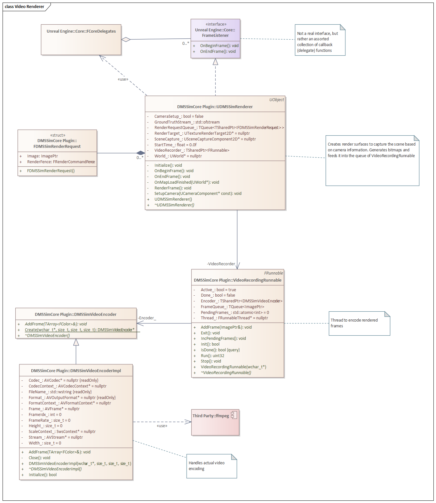
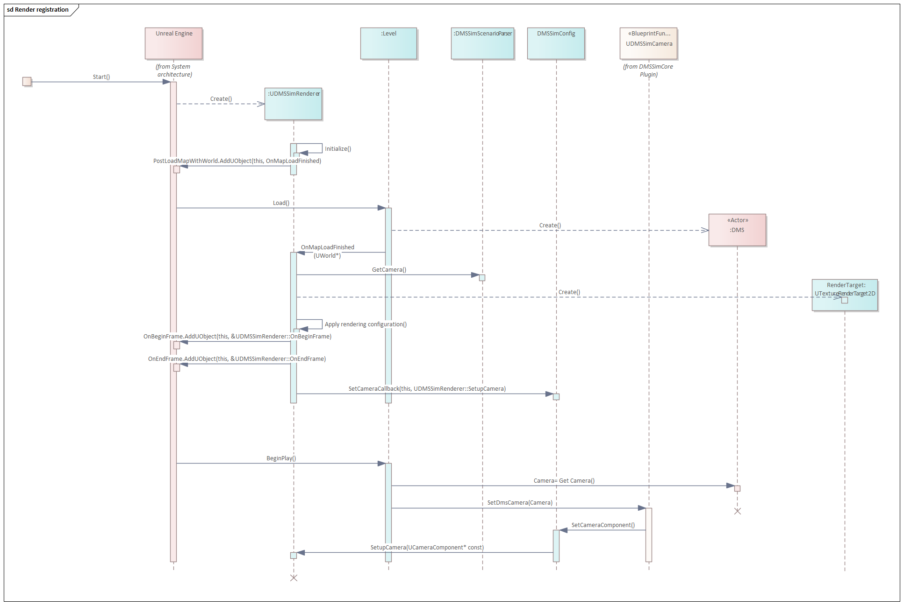
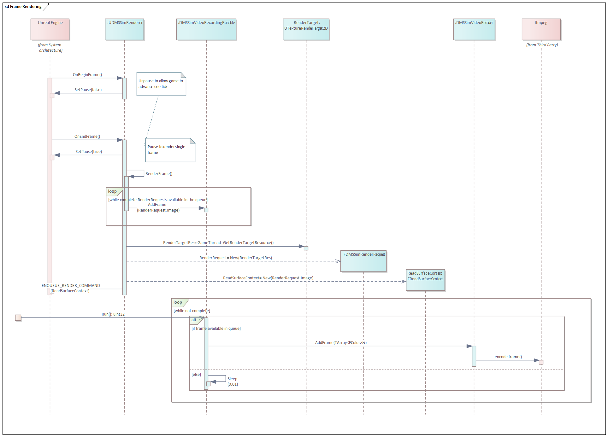

# 06. Video rendering

## Table of contents

- [Video rendering classes](#video-rendering-classes)
- [Registering video renderer and camera](#registering-video-renderer-and-camera)
- [Frame rendering and encoding](#frame-rendering-and-encoding)

## Video rendering classes 

The logic of recording video files is implemented in the `DMSSimCore` plugin. 

The main orchestration is performed by class [UDMSSimRenderer](../../../DMS_Simulation/Plugins/DMSSimCore/Source/DMSSimCore/Public/DMSSimRenderer.h).
It uses core capabilities of Unreal Engine (`SceneCaptureComponent`) to render frames and then hands them over to the `ffmpeg` library for encoding.

## Registering video renderer and camera 

Upon Unreal Engine start, it creates default objects of all `UObject` classes, including `UDMSSimRenderer`.

`UDMSSimRenderer` will register itself as a `Map Load Listener`. Thus, once the environment is loaded, `UDMSSimRenderer` is able to register itself as a `Frame Listener`.

`UDMSSimRenderer` will create necessary objects such as `Scene Capture Component`.

Once everything is loaded, the `DMS actor` present will inform `UDMSSimRenderer` about the DMS camera used for capture and its properties and the frame rate. 

## Frame rendering and encoding 

Upon every frame, the functions `OnBeginFrame` (before scene is calculated) and `OnEndFrame` (after scene is calculated) will be called. 

The latter function will pause the execution of the scene and trigger a scene capture command. The request to capture the scene will be enqueued, because scene capture is happening on the GPU, and completion status can be monitored using a `Fence` command.

Once the rendering on GPU is done, the `Fence` will be marked as complete, and the `RenderRequest` object will contain the buffer of BGRA pixels.

This buffer is then handed over to [DMSSimVideoRecordingRunable](../../../DMS_Simulation/Plugins/DMSSimCore/Source/DMSSimCore/Private/DMSSimVideoRecordingRunable.h), which operates a separate thread to handle video encoding. It will enqueue the frame for encoding.

The worker thread of `DMSSimVideoRecordingRunable` calls `ffmpeg` API to encode the frame.