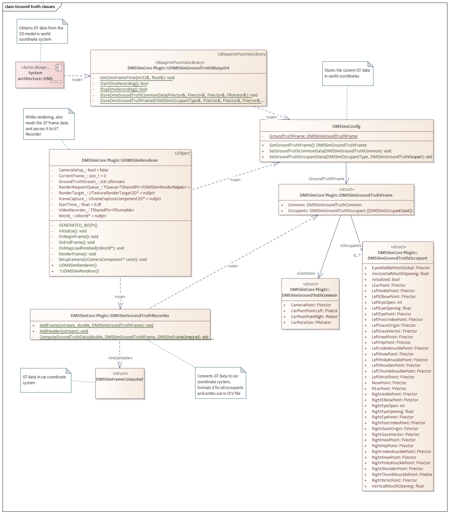

# 07. Ground truth recording

## Table of contents

## Overview

Ground truth data is extracted from the 3D model by blueprints (`DMS actor`).

Storing of GT data is implemented in the `DMSSimCore` plugin.

On every frame, the `DMS actor` calls the `UDMSSimGroundTruthBlueprint::StoreDmsGroundTruthCommonData`  with frame-wide data, such as car pose or camera pose. Then it iterates over occupants, extracts relevant data from the 3D mode and calls `UDMSSimGroundTruthBlueprint::StoreDmsGroundTruthCommonData`.

The `DMSSimConfig::GroundTruthFrame` object serves barely as a buffer for the data.

As described in [Frame rendering and encoding](../06-Video_rendering/README.md#frame-rendering-and-encoding), `UDMSSimRenderer` gets called after each frame has been calculated, pauses the game and renders the corresponding image. Because the game is paused and all data are calculated already, it is also good time to store the GT data. So  `UDMSSimRenderer` gets `DMSSimConfig::GroundTruthFrame` and hands it over to `DMSSimGroundTruthRecorder`.

The `DMSSimGroundTruthRecorder` converts the GT data from world coordinate system to car coordinate system by applying the transformations defined in project config. Subsequently, it encodes the data according to the column names.

## Obtaining the GT data

## Writing the CSV